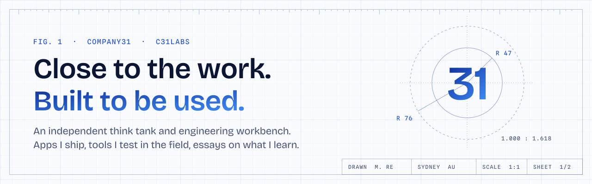
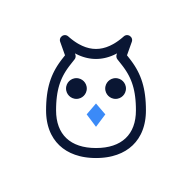
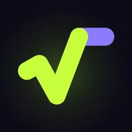

<a href="https://company31.com">
  <picture>
    <source media="(prefers-color-scheme: dark)" srcset="assets/banner-dark.svg">
    
  </picture>
</a>

  
  
  
  

### 👋 I'm Manuel Re. I build tools for people doing real work.

**Enterprise-quality apps at a fraction of the cost. Private by design, secure by default.**

For 25 years I led delivery for banks, governments, carmakers and newsrooms. Now I'm back on the tools. **Company31** is my independent think tank and engineering workbench in Sydney, and I practise what I call *forward-deployed engineering*:

> 🔍 **Understand the work** alongside the people doing it &nbsp;·&nbsp; 🛠️ **Build what helps** around the habits already in place &nbsp;·&nbsp; 🔁 **Learn from use** and bring it back to the bench

This is where the code lives. The finished products are up top; the drawer of experiments is open below.

---

## 🧰 On the bench

Things I ship and look after. Their source is private, so each one links to where you can use it.

<table>
  <tr>
    <td width="72" align="center"></td>
    <td>
      <a href="https://company31.com/owly/"><b>Owly</b></a> &nbsp;
      
      
       
      📝 Notes that stay yours. Every note is a plain Markdown file in a folder you choose: no account, no subscription, no lock-in. Speak into your watch and your iPhone writes it into the vault. 
      
      &nbsp;
    </td>
  </tr>
  <tr>
    <td align="center"></td>
    <td>
      <a href="https://company31.com/mathcitizen/"><b>Math Citizen</b></a> &nbsp;
      
      
       
      🧮 A maths puzzle game that sets every puzzle at the edge of what you can do, from single-digit sums to equations and powers. Apple Intelligence invents fresh story settings on the device; the app computes every number and answer. No ads, no accounts, no data collected. 
      
    </td>
  </tr>
  <tr>
    <td align="center"></td>
    <td>
      <a href="https://company31.com/slotello/"><b>Slotello</b></a> &nbsp;
      
      
       
      📅 Online booking and practice admin for Australian allied health practices: a booking page in your colours, Square payments, SMS and email reminders, client records. Built and hosted in Sydney. 
      <a href="https://slotello.company31.com/demo"><b>Try the live demo →</b></a>
    </td>
  </tr>
  <tr>
    <td align="center"></td>
    <td>
      <a href="https://company31.com/cybersafe/"><b>CyberSafe</b></a> &nbsp;
      
      
       
      🛡️ A plain-English security health check for a website you own: a 0 to 100 score, an A to F grade and a prioritised list of fixes. Consent-based and passive. It never attacks anything. 
      <a href="https://company31.com/cybersafe/"><b>Check your site →</b></a>
    </td>
  </tr>
  <tr>
    <td align="center"></td>
    <td>
      <a href="https://proofline.company31.com/"><b>Proofline</b></a> &nbsp;
      
      
       
      📑 Acquittal readiness for funded organisations. Record the obligations in a funding agreement and see which have evidence behind them, which don't, and how exposed you are before the report is due. 
      <a href="https://proofline.company31.com/"><b>See Proofline →</b></a>
    </td>
  </tr>
</table>

---

## 🗄️ In the drawer

Public, unfinished and open to inspection. Experiments, prototypes and small tools, most of them a single file you can open and read. Take what's useful. ⭐ the ones you like.

#### 🤖 Applied AI

| | Repo | What it does |
|:-:|---|---|
| 🧠 | [**AgentArchitect**](https://github.com/c31labs/AgentArchitect) | A meta-agent that turns "I want an agent that does X" into a spec you can ship. |
| 🌫️ | [**drift**](https://github.com/c31labs/drift) | AI-assisted note taking. |
| 🏮 | [**Lanternbound**](https://github.com/c31labs/solodnd) | A solo fantasy journey where the book, the Oracle and your hero write the world together. [Play it →](https://direwrought.com/lanternbound/) |
| 🐉 | [**solo-D-D-experiment**](https://github.com/c31labs/solo-D-D-experiment) | The first sketch of a solo tabletop RPG run by a model. |

#### 🧭 Delivery tools

| | Repo | What it does |
|:-:|---|---|
| 🪒 | [**Occam**](https://github.com/c31labs/Occam) | An opinionated Agile board that enforces WIP limits and locks the backlog at 100 tickets. |
| 🎯 | [**leadflow**](https://github.com/c31labs/leadflow) | Lead management in Java and Spring Boot, with scoring, tags and a pipeline. |
| 🤝 | [**NexusCRM**](https://github.com/c31labs/NexusCRM) | A small CRM: contacts, deals, history and notes. |
| 🗓️ | [**resourceplanner**](https://github.com/c31labs/resourceplanner) | Who is doing what, and when. |
| 🧩 | [**TaskFlow**](https://github.com/c31labs/global360assignement) | A reference implementation of how a delivery is structured and run, slides included. |
| 💼 | [**bcspeedruntraining**](https://github.com/c31labs/bcspeedruntraining) | A five-day Business Central finance speedrun. |

#### ⏱️ Focus and writing

| | Repo | What it does |
|:-:|---|---|
| 🥑 | [**Avocado Focus**](https://github.com/c31labs/avocadotimer) | A native macOS focus timer: a small avocado on your desktop whose pit counts down. |
| 👾 | [**Pc Avo Timer**](https://github.com/c31labs/pcavotimer) | Its portable Windows cousin, in 1990s pixel art. No installer, no internet. |
| 🏛️ | [**pomodorophy**](https://github.com/c31labs/pomodorophy) | A Pomodoro timer with a Stoic quote between sessions. |
| 📓 | [**journal**](https://github.com/c31labs/journal) | Private journaling. |
| ✒️ | [**markdowneditor**](https://github.com/c31labs/markdowneditor) | A focused Markdown editor. |
| 🎞️ | [**mdslidedeck**](https://github.com/c31labs/mdslidedeck) | Turn Markdown into slide decks. |
| 🏷️ | [**titlesuggestor**](https://github.com/c31labs/titlesuggestor) | Pick the right title for a post or a video. |
| 📖 | [**readaroo**](https://github.com/c31labs/readaroo) | A reading helper. |
| 🐚 | [**zshterminalscript**](https://github.com/c31labs/zshterminalscript) | Shell scripts I actually use. |

#### 🌱 Learning and wellbeing

| | Repo | What it does |
|:-:|---|---|
| 🔮 | [**Spelgram 3000**](https://github.com/c31labs/splegram3000) | A spelling and grammar adventure for Years 5 to 7, with family accounts. |
| 🎓 | [**naplan5game**](https://github.com/c31labs/naplan5game) | NAPLAN Year 5 practice, gamified. |
| 🔐 | [**cybercheck**](https://github.com/c31labs/cybercheck) | Test basic cyber safety skills, for executives, employees and kids. |
| 🌤️ | [**moodchecker**](https://github.com/c31labs/moodchecker) | A quick wellbeing, mood and anxiety check-in. |
| ☀️ | [**CheerUp**](https://github.com/c31labs/cheerup) | A SwiftUI app for motivational quotes and mood tracking, with HealthKit. |

<b>♟️ Games and tabletop</b>: the best way to test a new idea is a small game

 

| | Repo | What it does |
|:-:|---|---|
| ♟️ | [**Age-of-AI-Chess**](https://github.com/c31labs/Age-of-AI-Chess) | Chess, with an AI twist. |
| 🏺 | [**ludus-coriovalli**](https://github.com/c31labs/ludus-coriovalli) | An ancient Roman board game, rebuilt in modern tech. |
| 🁫 | [**mexicandomino**](https://github.com/c31labs/mexicandomino) | A simple, hackable game of dominoes. |
| ☄️ | [**asteroid**](https://github.com/c31labs/asteroid) | Asteroids, built with Claude. |
| 🃏 | [**pokertutor**](https://github.com/c31labs/pokertutor) | Learn poker as you play. |
| 🐍 | [**pokectapl**](https://github.com/c31labs/pokectapl) | Poker experiments in Python. |
| 📜 | [**ALtraker**](https://github.com/c31labs/ALtraker) | An Adventurers League logbook for sessions and characters. |
| 🗺️ | [**adventureleaguenotebooktracker**](https://github.com/c31labs/adventureleaguenotebooktracker) | A notebook and session tracker for D&D Adventurers League. |
| ⚔️ | [**WFRP character sheet**](https://github.com/c31labs/Warhammer-Fantasy-Role-Play-s-character-sheet-4th-edition-) | A character sheet for Warhammer Fantasy Roleplay, 4th edition. |

---

## ✍️ Latest essays

Sheet 2 of the drawing. I write at [manuelre.com](https://manuelre.com) about delivery, change and applied AI, and what building things teaches about all three.

<!-- BLOG-POST-LIST:START -->
- [The quieter conundrum](https://manuelre.com/post.php?slug=the-quieter-conundrum)
- [What discomfort actually measures](https://manuelre.com/post.php?slug=what-discomfort-measures)
- [Skilled for the work that was](https://manuelre.com/post.php?slug=skilled-for-the-work-that-was)
- [Back on the tools](https://manuelre.com/post.php?slug=back-on-the-tool)
- [The product after the prototype](https://manuelre.com/post.php?slug=the-product-after-the-prototype)<!-- BLOG-POST-LIST:END -->

📡 Refreshed daily from the <a href="https://manuelre.com/feed.php">RSS feed</a>.

---

## 🧑‍🔧 About me

I spent my career on the enterprise side of technology: banking, government, automotive and media, leading the teams that delivered the product. What stuck with me is that the best software is designed next to the person using it, not in a meeting about them.

So I went back to building. I pick a real problem, sit with the people who have it, and ship something small that helps. Then I watch what happens and fix what I got wrong. Some of it becomes a product. Some of it stays in the drawer. All of it teaches me something I write up at [manuelre.com](https://manuelre.com).

My test for every build: **does this make someone more capable?** Technology should give people back time and judgement, not take their place.

<table>
  <tr>
    <td>📍 <b>Based in</b></td><td>Sydney, Australia 🇦🇺</td>
  </tr>
  <tr>
    <td>🧪 <b>Working on</b></td><td>Owly, Math Citizen and Slotello, and whatever the next field visit turns up</td>
  </tr>
  <tr>
    <td>🧭 <b>Method</b></td><td>See clearly. Choose well. Change once.</td>
  </tr>
  <tr>
    <td>🤝 <b>Collaborate</b></td><td>I take on a small number of collaborations. Email <b>connect [at] company31 [dot] com</b> and tell me about the people doing the work, where it gets hard, and what you've already tried. I read and answer every one myself.</td>
  </tr>
</table>

### 🔧 What I build with

  
  
  
  
  
  
  
  
  
  
  
  

### 📐 House style

- ✋ **Hand-authored.** Vanilla HTML, CSS and JS where it fits. Swift, TypeScript or Python where it earns it.
- 🪶 **No build step** unless the project genuinely needs one.
- 🔏 **Consent first** on anything that touches a person. No analytics before you say yes.
- 📦 **Your data stays yours.** Plain files, open formats, nothing you can't take with you.
- 💬 **Plain English** in READMEs, readable commits, small PRs.

---

  <b>Found something useful?</b> Pass it on 👇  
  
  
  

SHEET 1 OF 2 &nbsp;·&nbsp; DRAWN BY M. RE &nbsp;·&nbsp; SYDNEY, AU &nbsp;·&nbsp; BUILT WITH RESTRAINT

